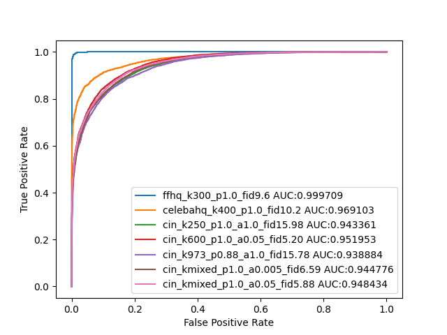

# Synthetic Image Detection
**Are GAN generated images easy to detect? A critical analysis of the state-of-the-art**
 Diego Gragnaniello, Davide Cozzolino, Francesco Marra, Giovanni Poggi and Luisa Verdoliva.
 In IEEE International Conference on Multimedia and Expo (ICME), 2021.
 https://github.com/grip-unina/GANimageDetection

## Stylegan2

### FFHQ
||ROC-AUC|Accuracy|Precision|Recall|
|---|:---:|:---:|:---:|:---:|
|stylegan2-config-f-psi-0.5|1.0|1.0|1.0|1.0|
|stylegan2-config-f-psi-1.0|1.0|1.0|1.0|1.0|

### Car
### Cat
### Church
### Horse

## Stylegan3
Testing Data Fake (generated using [code](./images_generation/generate_stylegan3.sh), [docs](https://github.com/NVlabs/stylegan3)):
- FFHQ-U, config-t      (5k images)
- FFHQ-U, config-r      (5k images)
- AFHQv2, config-t      (5k images)
- AFHQv2, config-r      (5k images)
- Metfaces-U, config-t  (2k images)
- Metfaces-U, config-r  (2k images)

Testing Data Real (follewed this guide [https://github.com/NVlabs/stylegan3-detector](https://github.com/NVlabs/stylegan3-detector)): 
- FFHQ last 5K images
- AFHQv2 "test" folder (1467 images)
- Metfaces last 336 images

### FFHQ
||ROC-AUC|Accuracy|Precision|Recall|
|---|:---:|:---:|:---:|:---:|
|stylegan3-r-ffhqu-1024x1024|0.99831276|0.5004|1.0|0.0008|
|stylegan3-t-ffhqu-1024x1024|0.9999528799999999|0.611|1.0|0.222|

### AFHQ_v2
||ROC-AUC|Accuracy|Precision|Recall|
|---|:---:|:---:|:---:|:---:|
|stylegan3-r-afhqv2-512x512|0.9956733469665984|0.4461110252048863|1.0|0.2836|
|stylegan3-t-afhqv2-512x512|0.9997738241308793|0.8427400649451059|1.0|0.7966|

### Metfaces
||ROC-AUC|Accuracy|Precision|Recall|
|---|:---:|:---:|:---:|:---:|
|stylegan3-r-metfacesu-1024x1024|0.9560014880952381|0.2688356164383562|1.0|0.146|
|stylegan3-t-metfacesu-1024x1024|0.9958303571428572|0.8167808219178082|1.0|0.786|

### All
||ROC-AUC|Accuracy|Precision|Recall|
|---|:---:|:---:|:---:|:---:|
|stylegan3-all-categories|0.9968246055661718|0.5846141573153221|1.0|0.349125|

## Gated Convolution Inpainting
- Fake images: grip-unina vipcup2022/gated_convolution_inpainting (2k images)
- Real images: coco dataset 2017 Test: http://images.cocodataset.org/zips/test2017.zip (2k images)

||ROC-AUC|Accuracy|Precision|Recall|
|---|:---:|:---:|:---:|:---:|
|gated_convolution_inpainting|0.56784725|0.52125|1.0|0.0425|

## GLIDE: Inpaiting and Image Generation
- Fake images: grip-unina vipcup2022/glide
    - inpainting (1k images)
    - text2img (1k images)
- Real images: coco dataset 2017 Test: http://images.cocodataset.org/zips/test2017.zip (1k images)

||ROC-AUC|Accuracy|Precision|Recall|
|---|:---:|:---:|:---:|:---:|
|inpainting|0.416831|0.5|0.0|0.0|
|text2img|0.684971|0.515|1.0|0.03|

## Taming Transformers
Fake datasets: https://k00.fr/j626x093
- ffhq_k300_p1.0_fid9.6 (5k fake vs 5k real)
- celebahq_k400_p1.0_fid10.2 (5k fake vs 4804 real)

||ROC-AUC|Accuracy|Precision|Recall|
|---|:---:|:---:|:---:|:---:|
|ffhq_k300_p1.0_fid9.6|0.9997090000000001|0.685|1.0|0.37|
|celebahq_k400_p1.0_fid10.2|0.9691025603663613|0.6730926152590779|1.0|0.359|

